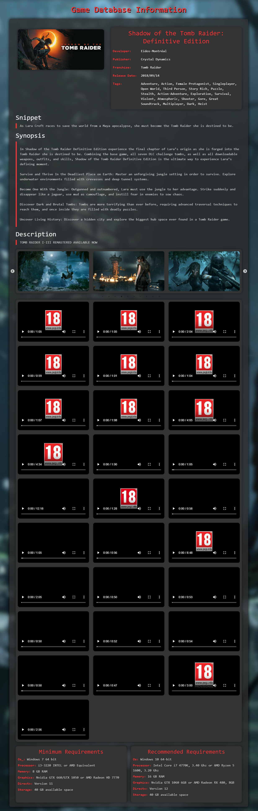

# Unofficial Steam Game Database Information API

## Overview

The Unofficial Steam Game Database Information API allows you to retrieve detailed information about Steam games using either the Steam game ID or the full Steam game URL. The API provides game details such as title, genre, developer, publisher, system requirements, and more.

Demo : [https://fadel.nasiwebhost.com/games/](https://fadel.nasiwebhost.com/games/)

## API Endpoint

### Base URL

```
https://fadel.nasiwebhost.com/games/steam.php?game=
```

### Supported Methods

- `GET`

## How to Use

### Request

You can call the API by appending the Steam game ID or the full Steam game URL to the base URL.

#### Using Steam Game ID

```plaintext
https://fadel.nasiwebhost.com/games/steam.php?game=1174180
```

#### Using Full Steam Game URL

```plaintext
https://fadel.nasiwebhost.com/games/steam.php?game=https://store.steampowered.com/app/1174180/Red_Dead_Redemption_2/
```

### Example Request

```plaintext
GET https://fadel.nasiwebhost.com/games/steam.php?game=1174180
```

### Screenshoot


### Response

The API returns a JSON object with the game information.

#### Example Response

```json
{
  "status": "success",
  "data": {
    "title": "Red Dead Redemption 2",
    "genre": "Action, Adventure",
    "developer": "Rockstar Games",
    "publisher": "Rockstar Games",
    "franchise": "Red Dead Redemption",
    "release date": "6 Dec, 2019",
    "tags": "Open World, Story Rich, Western, Adventure, Multiplayer, Action, Realistic, Singleplayer, Shooter, Atmospheric, Horses, Beautiful, Mature, Third-Person Shooter, Great Soundtrack, Third Person, Gore, Sandbox, First-Person, FPS",
    "system_requirements": {
      "minimum": {
        "0": "Requires a 64-bit processor and operating system",
        "OS": "Windows 10 - April 2018 Update (v1803)",
        "Processor": "Intel® Core™ i7-4770K / AMD Ryzen 5 1500X",
        "Memory": "12 GB RAM",
        "Graphics": "Nvidia GeForce GTX 1060 6GB / AMD Radeon RX 480 4GB",
        "Network": "Broadband Internet connection",
        "Storage": "150 GB available space",
        "Sound Card": "Direct X Compatible"
      },
      "recommended": {
        "0": "Requires a 64-bit processor and operating system",
        "OS": "Windows 10 - April 2018 Update (v1803)",
        "Processor": "Intel® Core™ i7-4770K / AMD Ryzen 5 1500X",
        "Memory": "12 GB RAM",
        "Graphics": "Nvidia GeForce GTX 1060 6GB / AMD Radeon RX 480 4GB",
        "Network": "Broadband Internet connection",
        "Storage": "150 GB available space",
        "Sound Card": "Direct X Compatible"
      }
    },
    "videos": [
      "https://cdn.akamai.steamstatic.com/steam/apps/256768371/movie_max.mp4",
      "https://cdn.akamai.steamstatic.com/steam/apps/256768370/movie_max.mp4"
    ],
    "images": [
      "https://shared.akamai.steamstatic.com/store_item_assets/steam/apps/1174180/ss_66b553f4c209476d3e4ce25fa4714002cc914c4f.1920x1080.jpg",
      "https://shared.akamai.steamstatic.com/store_item_assets/steam/apps/1174180/ss_bac60bacbf5da8945103648c08d27d5e202444ca.1920x1080.jpg",
      "https://shared.akamai.steamstatic.com/store_item_assets/steam/apps/1174180/ss_668dafe477743f8b50b818d5bbfcec669e9ba93e.1920x1080.jpg",
      "https://shared.akamai.steamstatic.com/store_item_assets/steam/apps/1174180/ss_4ce07ae360b166f0f650e9a895a3b4b7bf15e34f.1920x1080.jpg",
      "https://shared.akamai.steamstatic.com/store_item_assets/steam/apps/1174180/ss_d1a8f5a69155c3186c65d1da90491fcfd43663d9.1920x1080.jpg"
    ],
    "game_header": "https://shared.akamai.steamstatic.com/store_item_assets/steam/apps/1174180/header.jpg",
    "synopsis": "America, 1899.<br><br>Arthur Morgan and the Van der Linde gang are outlaws on the run. With federal agents and the best bounty hunters in the nation massing on their heels, the gang must rob, steal and fight their way across the rugged heartland of America in order to survive. As deepening internal divisions threaten to tear the gang apart, Arthur must make a choice between his own ideals and loyalty to the gang who raised him.<br><br>Now featuring additional Story Mode content and a ful...
    "game_description": "About This GameAmerica, 1899.<br><br>Arthur Morgan and the Van der Linde gang are outlaws on the run. With federal agents and the best bounty hunters in the nation massing on their heels, the gang must rob, steal and fight their way across the rugged heartland of America in order to survive. As deepening internal divisions threaten to tear the gang apart, Arthur must make a choice between his own ideals and loyalty to the gang who raised him.<br><br>Now featuring additional Story...
    "snippet": "Winner of over 175 Game of the Year Awards and recipient of over 250 perfect scores, RDR2 is the epic tale of outlaw Arthur Morgan and the infamous Van der Linde gang, on the run across America at the dawn of the modern age. Also includes access to the shared living world of Red Dead Online."
  }
}
```

## Response Fields

- `status`: Status of the API call (`success` or `failure`).
- `data`: A JSON object containing detailed game information:
  - `title`: Title of the game.
  - `genre`: Game genres.
  - `developer`: Game developer(s).
  - `publisher`: Game publisher(s).
  - `franchise`: Game franchise.
  - `release date`: Release date of the game.
  - `tags`: Relevant tags associated with the game.
  - `system_requirements`: Minimum and recommended system requirements for the game.
  - `videos`: URLs to game trailers or videos.
  - `images`: URLs to game images or screenshots.
  - `game_header`: URL to the game header image.
  - `synopsis`: Brief synopsis of the game.
  - `game_description`: Detailed description of the game.
  - `snippet`: A brief snippet about the game.

## Example Usage

### Python

```python
import requests

game_id = "1174180"
url = f"https://fadel.nasiwebhost.com/games/steam.php?game={game_id}"
response = requests.get(url)

if response.status_code == 200:
    game_info = response.json()
    print(game_info)
else:
    print(f"Error: {response.status_code}")
```

### JavaScript

```javascript
const gameId = "1174180";
const url = `https://fadel.nasiwebhost.com/games/steam.php?game=${gameId}`;

fetch(url)
  .then(response => response.json())
  .then(data => console.log(data))
  .catch(error => console.error('Error:', error));
```

## Notes

- Ensure you have a stable internet connection to fetch data from the API.
- The API response time may vary depending on the server load and network conditions.
- The API provides unofficial data and may not always be up-to-date with the latest game information on Steam.

For further assistance, feel free to open an issue on the repository. Happy gaming!
